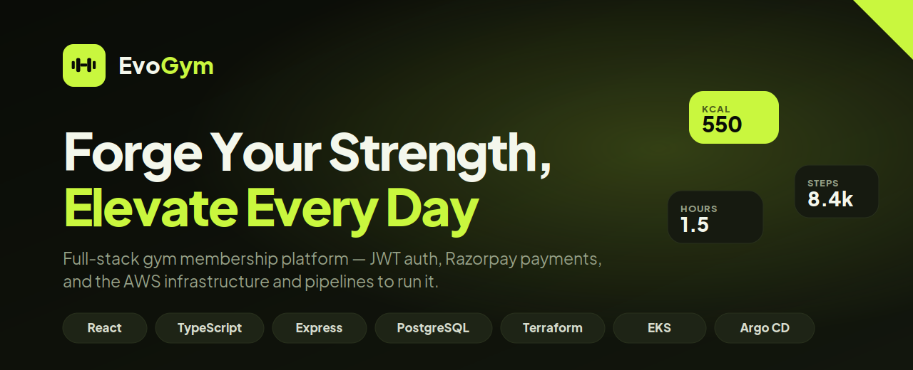

<div align="center">



# Forge Your Strength, Elevate Every Day

**A full-stack gym membership platform** — members sign up, pick a plan, pay
through Razorpay, and track their membership to the day. Shipped with the AWS
infrastructure and delivery pipelines to run it in three environments.

<p>
  
  
  
  
  
  
</p>

</div>

---

```
React + Vite  ──►  Express + Prisma  ──►  PostgreSQL
     │                    │
     │                    └──►  Razorpay (payments)
     │
     └──►  one ALB routes /api to the backend, everything else to the SPA
```

| Part | Location | Stack |
|---|---|---|
| Frontend | `frontend/` | React 18, TypeScript, Vite, Tailwind |
| Backend | `backend/` | Node 20, Express, Prisma, PostgreSQL, JWT, Razorpay |
| Infrastructure | `devops/` | Terraform, EKS on Fargate, RDS, ECR, ALB, Argo CD |
| Pipelines | `.github/workflows/` | GitHub Actions with OIDC (no AWS keys) |

Each part documents itself: [frontend](./frontend/README.md) ·
[backend](./backend/README.md) · [infrastructure](./devops/README.md).

## What it does

- **Accounts** — register, sign in, password reset. Access tokens are
  short-lived and held in memory; the refresh token is an httpOnly cookie, so
  an XSS bug can't steal a durable session.
- **Membership** — plans are public; buying one requires an account.
- **Payments** — Razorpay Checkout, with the signature verified server-side
  before a subscription activates. A webhook covers the case where the browser
  never reports back.
- **Account area** — current membership, days remaining, payment history.
- **Enquiries** — contact form writes to the database, with an admin queue.

## Running it locally

Two terminals. **Backend first:**

```bash
cd backend
npm install
cp .env.example .env        # DATABASE_URL, JWT secrets, Razorpay test keys
npx prisma migrate dev
npm run seed                # 3 membership plans + an admin user
npm run dev                 # http://localhost:5000
```

**Then the frontend:**

```bash
cd frontend
npm install
npm run dev                 # http://localhost:5173
```

The dev server proxies `/api` to `localhost:5000`, so the two work together
with no extra configuration. Seeded admin: `admin@evogym.com` / `ChangeMe123!`
— change it before deploying anywhere.

You'll need PostgreSQL running locally and a Razorpay **test mode** key pair.

## Deploying

Full walkthrough in [`devops/README.md`](./devops/README.md). In short:

```bash
cd devops/scripts && ./bootstrap-state-backend.sh   # once per AWS account
cd ../terraform/global/shared && terraform init && terraform apply
cd ../../environments/dev     && terraform init && terraform apply
aws eks update-kubeconfig --region ap-south-1 --name evogym-dev
kubectl apply -f devops/argocd/bootstrap/root-app-dev.yaml
```

After that, pushing to a branch *is* the deployment:

| Branch | Environment | Argo CD |
|---|---|---|
| `develop` | dev | syncs automatically |
| `staging` | staging | syncs automatically |
| `main` | prod | waits for a manual promote |

GitHub Actions builds the image, pushes it to ECR tagged with the commit SHA,
and commits the new tag into the matching Kustomize overlay. Argo CD notices
and rolls it out — running `prisma migrate deploy` first, so the schema is
always ahead of the code that needs it.

## Not built yet

- **Email delivery** — password-reset links print to the server console in
  development. Point `backend/src/services/mailer.service.ts` at SES, Resend
  or SendGrid to go live.
- **HTTPS** — both Ingresses listen on port 80. Add an ACM certificate and a
  443 listener once you have a domain.
- **Class booking** — described in the landing copy, no backend behind it.
- **Admin UI** — plan and enquiry management is API-only, admin role required.
- **Tests** — CI runs type-checking and linting; there's no test suite yet.
